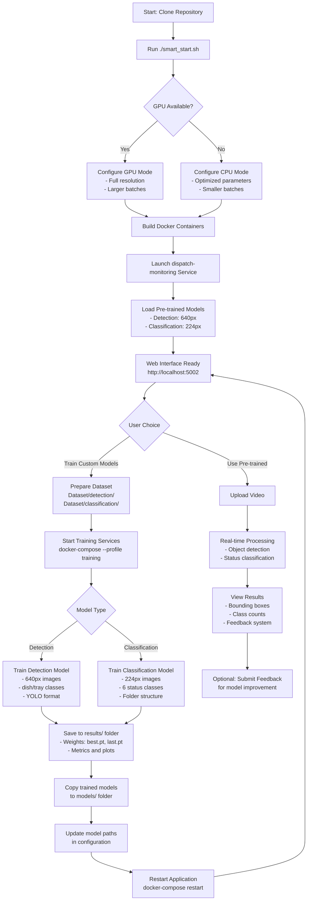

# Dispatch Monitoring System

A real-time and high accuracy computer vision system for real-time monitoring of dish and tray status in restaurant and food service environments. Built with YOLO11 detection and classification models, featuring automatic GPU/CPU optimization and cross-platform Docker deployment.

## <span style="color: #2E8B57;">Project Overview</span>

The Dispatch Monitoring System provides intelligent monitoring capabilities for kitchen dispatch operations through:

- **Real-time Video Processing**: Live analysis of dish and tray status with sub-second response times
- **Dual-Model Architecture**: Combined detection and classification for comprehensive object analysis
- **Web-Based Interface**: Modern, responsive web application accessible from any device
- **Automatic Hardware Optimization**: Seamless GPU/CPU detection and performance tuning
- **Cross-Platform Support**: Runs on Windows, macOS, Linux, and ARM64 platforms
- **Training Pipeline**: Complete workflow for training custom models with your data

## <span style="color: #2E8B57;">Demo</span>


### <span style="color: #4682B4;">Detection Capabilities</span>

**Detection Model**: Identifies objects as `dish` or `tray` (2 classes) - trained at 640px resolution
**Classification Model**: Categorizes objects by status (6 classes) - trained at 224px resolution:
- `dish_empty`, `dish_kakigori`, `dish_not_empty`
- `tray_empty`, `tray_not_empty`, `tray_kakigori`

## <span style="color: #2E8B57;">System Workflow</span>

The following diagram illustrates the complete workflow from setup to operation:



## <span style="color: #2E8B57;">Quick Start Guide</span>

### <span style="color: #4682B4;">Prerequisites</span>

**Supported Operating Systems**:
- Windows 10/11 with Docker Desktop
- macOS 10.15+ with Docker Desktop  
- Linux (Ubuntu 18.04+, CentOS 7+, etc.) with Docker Engine
- ARM64 platforms (Apple Silicon M1/M2, Raspberry Pi 4+)

**Hardware Requirements**:
- 8GB+ RAM (16GB+ recommended for training)
- 10GB+ free disk space (50GB+ for training datasets)
- NVIDIA GPU (optional - automatic CPU fallback available)
- Internet connection for downloading dependencies

### <span style="color: #4682B4;">Installation and Setup</span>

#### Option 1: Automatic Setup (Recommended)

```bash
# Clone the repository
git clone https://github.com/your-repo/New_Dispatch_Monitoring_System
cd New_Dispatch_Monitoring_System

# One-command setup with automatic hardware detection
./smart_start.sh
```

This script automatically:
1. Detects GPU support and Docker capabilities
2. Configures optimal settings for your hardware
3. Builds and starts the application
4. Shows device detection results and access URLs

#### Option 2: Manual Setup

```bash
# Build and start the application
docker-compose build
docker-compose up -d dispatch-monitoring

# Verify deployment
python validate_deployment.py

# Access the application at http://localhost:5002
```

### <span style="color: #4682B4;">Accessing the Application</span>

After successful deployment:
- **Main Application**: http://localhost:5002
- **Health Check**: http://localhost:5002/health
- **System Status**: http://localhost:5002/api/system/status

## <span style="color: #2E8B57;">Training New Models</span>

### <span style="color: #4682B4;">Dataset Preparation</span>

Your dataset must be organized in the `Dataset/` directory (automatically mounted in Docker containers via `./Dataset:/app/Dataset` volume):

**Detection Dataset Structure (YOLO format)**:
```
Dataset/
  detection/
    train/
      images/        # Training images (.jpg, .png)
      labels/        # YOLO format labels (.txt)
    val/
      images/        # Validation images
      labels/        # Validation labels
    dataset.yaml     # Dataset configuration file
```

**Classification Dataset Structure (folder-based)**:
```
Dataset/
  classification/
    dish/
      empty/         # Empty dish images
      kakigori/      # Kakigori dish images
      not_empty/     # Non-empty dish images
    tray/
      empty/         # Empty tray images
      not_empty/     # Non-empty tray images
      kakigori/      # Kakigori tray images
```

### <span style="color: #4682B4;">Quick Training Setup</span>

```bash
# Train detection model (640px images, dish/tray classes)
docker-compose --profile training up training-detection

# Train classification model (224px images, 6 status classes)
docker-compose --profile training up training-classification

# Monitor training progress
docker-compose logs -f training-detection
```

### <span style="color: #4682B4;">Custom Training Parameters</span>

Resume training from a checkpoint or train with custom parameters:

```bash
# Access training container for custom parameters
docker-compose exec training-detection bash

# Resume detection training from last checkpoint
python training/train_detection.py --resume --weights results/detection_model_*/weights/last.pt

# Resume classification training from last checkpoint
python training/train_classification.py --resume --weights results/classification_model_*/weights/last.pt

# Custom training with specific parameters
python training/train_detection.py --epochs 100 --batch-size 16 --img-size 640
python training/train_classification.py --epochs 100 --batch-size 16 --img-size 224
```

## <span style="color: #2E8B57;">Changing Models</span>

### <span style="color: #4682B4;">Using Your Trained Models</span>

1. **Locate Your Models**: After training, models are saved in the `results/` directory
2. **Copy to Models Directory**: Move the best performing model to the `models/` folder
3. **Update Configuration**: Edit the model paths in your environment configuration
4. **Restart Application**: The system will automatically load your new models

```bash
# Copy your trained models from results to models directory
cp results/detection_model_*/weights/best.pt models/detection_model_yolo12s.pt
cp results/classification_model_*/weights/best.pt models/classification_model_yolo11s-cls_best.pt

# Update environment configuration (optional - create .env file)
echo "DETECTION_MODEL_PATH=models/detection_model_yolo12s.pt" > .env
echo "CLASSIFICATION_MODEL_PATH=models/classification_model_yolo11s-cls_best.pt" >> .env

# Restart the application to load new models
docker-compose restart dispatch-monitoring
```

### <span style="color: #4682B4;">Model Validation</span>

```bash
# Validate your model deployment
python validate_deployment.py

# Test model performance
docker-compose exec dispatch-monitoring python -c "
from video_streaming_app.core.video_processor import VideoProcessor
processor = VideoProcessor()
print('Models loaded successfully:', processor.load_models())
"
```

## <span style="color: #2E8B57;">System Architecture</span>

### <span style="color: #4682B4;">Project Structure</span>

```
New_Dispatch_Monitoring_System/
├── Dataset/                     # Training datasets (mounted in containers)
│   ├── detection/              # YOLO detection dataset
│   └── classification/         # Classification dataset
├── models/                     # Trained model files
│   ├── detection_model_yolo12s.pt
│   └── classification_model_yolo11s-cls_best.pt
├── results/                    # Training outputs and metrics
├── training/                   # Training scripts
│   ├── train_detection.py     # Detection model training
│   └── train_classification.py # Classification model training
├── video_streaming_app/        # Main web application
│   ├── core/                  # Core processing modules
│   ├── routes/                # API endpoints
│   ├── templates/             # Web interface templates
│   └── utils/                 # Utility functions
├── docker-compose.yml         # Container orchestration
├── Dockerfile                 # Container image definition
├── smart_start.sh            # Intelligent startup script
└── run_video_streaming_app.py # Application entry point
```

### <span style="color: #4682B4;">Docker Services</span>

The system is organized into specialized containerized services:

- **dispatch-monitoring**: Main video streaming application with web interface
- **training-detection**: Detection model training environment (640px images)
- **training-classification**: Classification model training environment (224px images)
- **database**: PostgreSQL database for storing feedback and analytics (optional)
- **monitoring**: Grafana dashboard for system monitoring (optional)
- **file-server**: Nginx server for model and result management (optional)

### <span style="color: #4682B4;">Core Components</span>

**Video Streaming Application** (`video_streaming_app/`):
- Real-time video processing with YOLO11 models
- Web-based interface with responsive design
- RESTful API for integration
- Feedback system for model improvement
- Automatic GPU/CPU detection and optimization

**Training Pipeline** (`training/`):
- Detection training: 640px images, YOLO format, dish/tray classes
- Classification training: 224px images, folder structure, 6 status classes
- Automatic device optimization (GPU/CPU)
- Model checkpointing and resumption capabilities
- Comprehensive metrics and visualization

**Model Management**:
- Pre-trained model loading and validation
- Dynamic device assignment (CUDA/CPU)
- Model switching and hot-reloading
- Performance monitoring and optimization

## <span style="color: #2E8B57;">Management Commands</span>

### <span style="color: #4682B4;">Container Management</span>

```bash
# View service status
docker-compose ps

# View application logs
docker-compose logs dispatch-monitoring

# Access container shell
docker-compose exec dispatch-monitoring bash

# Stop services
docker-compose down

# Complete cleanup with volumes
docker-compose down -v

# Scale services (if needed)
docker-compose up --scale dispatch-monitoring=2
```

### <span style="color: #4682B4;">Training Management</span>

```bash
# Check training progress
docker-compose logs -f training-detection
docker-compose logs -f training-classification

# Stop training
docker-compose stop training-detection

# Resume training from checkpoint
docker-compose exec training-detection python training/train_detection.py --resume

# Access training results
ls -la results/
```

### <span style="color: #4682B4;">Troubleshooting</span>

**Application Issues**:
```bash
# Check application logs
docker-compose logs dispatch-monitoring

# Restart specific service
docker-compose restart dispatch-monitoring

# Rebuild containers
docker-compose build --no-cache
```

**Device Detection Issues**:
```bash
# Check which device mode is being used
docker-compose logs dispatch-monitoring | grep "Using device"

# Force CPU mode if needed
FORCE_CPU=true docker-compose up dispatch-monitoring

# Verify GPU support
docker run --rm --gpus all nvidia/cuda:11.8-base-ubuntu22.04 nvidia-smi
```

**Port Conflicts**:
```bash
# Check port usage
netstat -an | grep 5002

# Change port in docker-compose.yml
ports:
  - "5003:5002"  # Use different external port
```

## <span style="color: #2E8B57;">License</span>

This project is licensed under the MIT License - see the LICENSE file for details.

---

**Note**: This system is designed for production use in restaurant and food service environments. The detection model operates at 640px resolution and the classification model at 224px resolution for optimal performance and accuracy. 