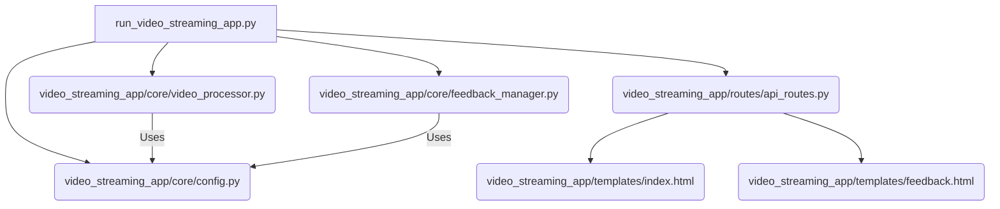

# Video Streaming Application

A professional, modular web app for real-time video monitoring, object detection, and classification using YOLO models. Includes a feedback system and modern UI for interactive review and annotation.

---

## Project Structure

```
video_streaming_app/
├── core/                    # Core logic and configuration
│   ├── config.py            # All app settings (models, video, UI, etc.)
│   ├── video_processor.py   # Video streaming, detection, classification
│   └── feedback_manager.py  # Feedback database management
├── routes/
│   └── api_routes.py        # All Flask routes and API endpoints
├── templates/
│   ├── index.html           # Main dashboard UI
│   └── feedback.html        # Feedback viewer UI
├── utils/                   # (Reserved for future utility code)
└── __init__.py
run_video_streaming_app.py   # Official launcher script (run this file)
```

### App Structure Diagram



---

## Logic Workflow

1. **Configuration Load**: On startup, the app loads all paths and parameters from `config.py`, including model paths, video path, inference area, and class/color settings.
2. **Model Initialization**: The detection (YOLO) and classification models are loaded into memory once at startup for fast inference.
3. **Video Capture Setup**: The video file is opened using OpenCV, and a dedicated processing thread is started to handle frame extraction and inference.
4. **Frame Acquisition**: For each processing cycle, the next frame is read from the video stream. If the video ends, it can loop or pause as configured.
5. **Inference Area Cropping**: The frame is cropped to the configured inference area (ROI) to focus processing and improve speed.
6. **Detection Inference**: The detection model runs on the cropped frame, producing bounding boxes and class predictions for all detected objects.
7. **Per-Object Classification**: For each detected object, the corresponding region is extracted and passed to the classification model for fine-grained class assignment.
8. **Result Aggregation**: The detection and classification results are combined, mapped to class names/colors, and stored for the current frame.
9. **Rendering**: Bounding boxes and class labels are drawn on the frame using the configured colors and styles. The processed frame is encoded for web streaming.
10. **Real-Time Streaming**: The processed frames are continuously streamed to the web UI via a Flask route, with minimal delay, using efficient JPEG encoding and threading to maintain real-time performance.
11. **Performance Management**: The system uses mutex locks and careful resource management to ensure thread safety and consistent frame rates, even under high load.

---

## Key Features (Non-Basic)

- **Real-Time Video Streaming** with YOLO-based detection & classification
- **Multi-Model Pipeline**: Separate detection and classification models
- **Six-Class Detection**: dish_empty, dish_kakigori, dish_not_empty, tray_empty, tray_kakigori, tray_not_empty
- **Color-Synchronized UI**: Class colors in UI match video bounding boxes
- **Interactive Controls**: Play/pause, frame seek, video selection (with cache clearing)
- **Feedback System**: Submit/view feedback linked to video frames, stored in SQLite
- **Thread-Safe Video Processing**: Robust error handling, resource cleanup, and mutex locks
- **Configurable Inference Area**: Easily set region of interest in config.py
- **Customizable Bounding Boxes**: All visual properties (color, thickness, font) are centralized in config.py

---

## How to Run

1. **Install dependencies** (from project root):
   ```bash
   pip install -r requirements.txt
   ```
2. **Prepare required files** (in project root):
   - `models/detection_model_yolo12s.pt`
   - `models/classification_model_yolo11s-cls_best.pt`
   - `testing_video.mp4`
   - `feedback.db` (auto-created if missing)
3. **Run the app**:
   ```bash
   python run_video_streaming_app.py
   ```
4. **Open in browser**: [http://localhost:5001](http://localhost:5001)

---

## Configuration & Customization

All settings are in `video_streaming_app/core/config.py`:
- **Model/video paths**
- **Class names & colors**
- **Bounding box style**
- **Inference area**
- **Server port, etc.**

---

## Feedback System
- All feedback is stored in `feedback.db` (root directory)
- View and manage feedback at `/feedback` in the web UI
- Feedback is linked to video frame and model state

---

## Requirements
- Python 3.8+
- See `requirements.txt` in the project root for all Python dependencies

---

## Notes
- Only run `run_video_streaming_app.py` (do not run modules directly)
- For advanced customization, edit `core/config.py`
- For production, use a process manager (e.g. gunicorn) and reverse proxy (e.g. nginx) 